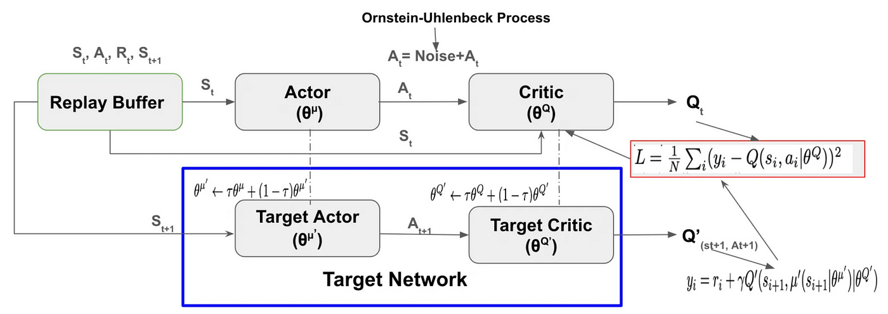
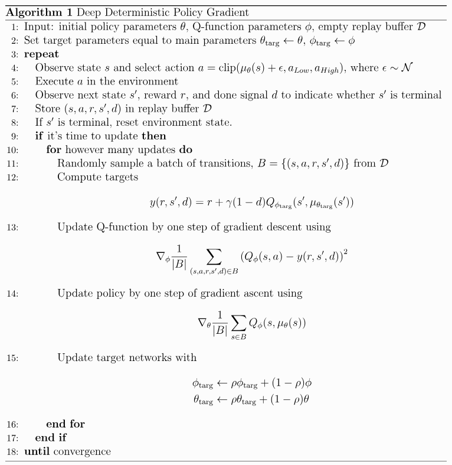

# DDPG

## Overview

This repository contains an implementation of the Deep Deterministic Policy Gradient (DDPG) algorithm. DDPG is an off-policy actor-critic algorithm designed for continuous action spaces, combining the benefits of DPG and DQN.

For a detailed understanding of DDPG, you can refer to the original research paper by Lillicrap et al.:
[Continuous control with deep reinforcement learning](https://arxiv.org/abs/1509.02971).

To learn more about DDPG and its applications, visit this [OpenAI Spinning Up page](https://spinningup.openai.com/en/latest/algorithms/ddpg.html).

## Architecture

*Image credit: [Medium](https://www.google.com/url?sa=i&url=https%3A%2F%2Farshren.medium.com%2Fstep-by-step-guide-to-implementing-ddpg-reinforcement-learning-in-pytorch-9732f42faac9&psig=AOvVaw3ys2ygMdUsEflgVP0SaycB&ust=1718279698088000&source=images&cd=vfe&opi=89978449&ved=0CBIQjRxqFwoTCMjj6-mA1oYDFQAAAAAdAAAAABBn)*

## Pseudocode

*Image credit: [OpenAI Spinning Up](https://spinningup.openai.com/en/latest/algorithms/ddpg.html)*
